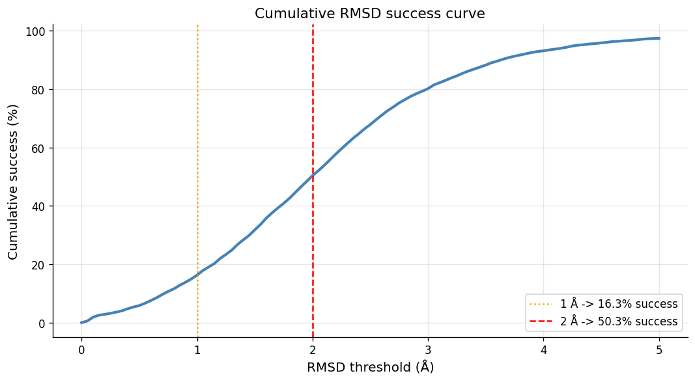
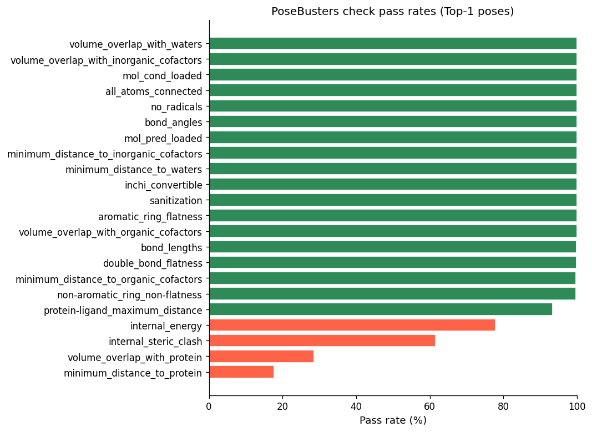
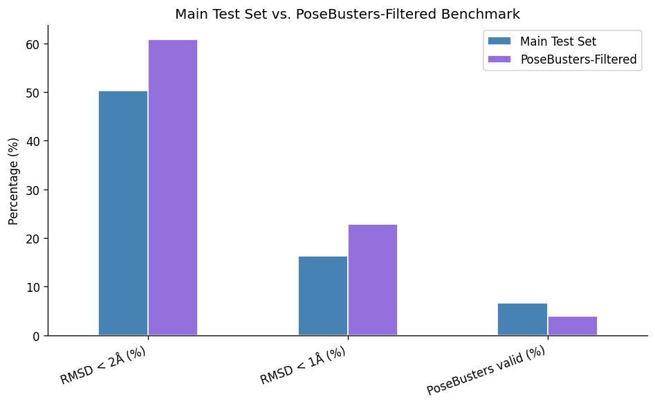

Failures concentrate in four checks: minimum distance to protein (18% pass), volume overlap with protein (29%), internal steric clash (61%) and internal energy (78%). The other eighteen checks pass at essentially 100% — poses are chemically well-formed but placed too far into the protein.



Accuracy is higher on the PoseBusters-filtered subset (60.8% vs 50.2% under 2 Å), consistent with its curated, higher-quality structures.# Benchmarking DiffDock-Pocket

Evaluation of [DiffDock-Pocket](https://github.com/plainerman/DiffDock-Pocket) — a diffusion-based docking model with flexible sidechains — on LP-HiQBind and PoseBusters test sets.

Seminar project, *Benchmarking DL-based Docking Tools* (SS 2026), Volkamer Lab, Saarland University.

## Results

Top-ranked pose per complex:

| Run | Complexes | RMSD < 2 Å | RMSD < 1 Å | Median RMSD | PB-Valid |
|---|---|---|---|---|---|
| proto_test | 136 | 95.6% | 27.2% | 1.19 Å | – |
| full_test (1 pose) | 4961 | 50.2% | 16.8% | 2.00 Å | 5.4% |
| full_test (3 poses) | 5156 | 50.3% | 16.3% | 1.99 Å | 6.6% |
| PoseBusters (1 pose) | 306 | 60.8% | 22.9% | 1.76 Å | 3.9% |
| PoseBusters (3 poses) | 300 | 58.7% | 26.0% | 1.82 Å | 4.7% |

**The prototype number is misleading.** 116 of its 136 complexes carry the same ligand (LU8). 95.6% measures memorisation, not docking.

**Accuracy is moderate; physical validity is the limiting factor.** About half of top-ranked poses fall within 2 Å of the crystal ligand, but fewer than 7% satisfy all PoseBusters checks. Predicted ligands are placed approximately correctly while violating basic geometric and steric constraints.

**Additional sampling did not improve accuracy.** Increasing from 1 to 3 poses per complex left RMSD < 2 Å unchanged on full_test (50.2% → 50.3%) and reduced it on the PoseBusters subset (60.8% → 58.7%). The confidence model does not reliably rank the better sample first.

## Setup

**Environment.** Custom Docker image built over `silterra/diffdock-pocket` with fixes for HPC compatibility:

```
docker.io/dhanya24/diffdock-pocket-v8:prototype
```

Conda specification in `environment.yml`.

**Training.** Two runs: a short prototype run (3 epochs, configuration in
`prototype/training/checkpoint/model_parameters.yml`) and a longer full-dataset
run. Both use flexible sidechains, pocket reduction, EMA (0.999), batch size 2,
6 convolution layers, learning rate 1e-3 with plateau scheduler.

Training curves for the full run are in
`notebooks/results_visualization_full_dataset.ipynb`. Training loss did not
decrease and validation loss oscillated across many orders of magnitude, so the
full-dataset results below characterise an unconverged model rather than
DiffDock-Pocket's published performance.

**Inference.** 20 denoising steps, sampling 1 or 3 poses per complex.

**Evaluation.** Symmetry-corrected heavy-atom RMSD against the crystal ligand, plus PoseBusters physical-validity checks (bond lengths and angles, steric clashes, ring flatness, internal energy, protein–ligand distances and volume overlap).

All training, inference and evaluation ran as HTCondor GPU jobs; the `.sub` and `.sh` files in each folder are the ones used.

**Not included.** The trained checkpoint (`best_ema_model.pt`, ~290 MB) is too large for this repository; `model_parameters.yml` documents the configuration needed to reproduce it. Input structures are not redistributed — the CSVs in `data/` list every complex used, available from [LP-HiQBind](https://github.com/THGLab/HiQBind) and [PoseBusters](https://github.com/maabuu/posebusters).

## Layout

```
src/
├── train.py                      training script
├── inference.py                  pose generation
├── evaluate_files.py             RMSD + PoseBusters evaluation
├── prepare_training_input.py     builds the training CSV
├── models/                       score model, layers
├── datasets/                     PDBBind loader, conformer matching, ESM embeddings
└── utils/                        diffusion, sampling, geometry, torsion, SO(3)

prototype/
├── training/
│   ├── diffdock_training.sub
│   ├── run_training.sh
│   └── checkpoint/model_parameters.yml
├── inference/
│   ├── diffdock_inference_teammate_ckpt.sub
│   ├── diffdock_inference_remaining.sub
│   ├── run_inference_*.sh
│   ├── inference_input.csv
│   └── proto_test_names_good.txt
├── evaluation/
│   ├── diffdock_evaluate.sub
│   └── run_evaluate.sh
└── results/
    └── proto_test_evaluation.csv    136 complexes, RMSD per pose

full/
├── training/
│   ├── diffdock_training_full.sub
│   └── run_training_full.sh
├── inference/
│   ├── inference_full.sub
│   ├── inference_posebusters.sub
│   ├── run_inference_*.sh
│   ├── build_full_test_csv.py
│   ├── prepare_inference_csv.py
│   └── prepare_posebusters_csv.py
├── evaluation/
│   ├── full_test_eval.sub, full_test_eval_pb.sub, full_test_eval_pb_3poses.sub
│   ├── posebusters_filtered_eval.sub, posebusters_filtered_eval_3poses.sub
│   ├── evaluate_full.sub
│   └── run_*.sh
└── results/
    ├── full_test_evaluation_with_pb.csv
    ├── full_test_evaluation_with_pb_3poses.csv
    ├── posebusters_filtered_evaluation.csv
    └── posebusters_filtered_evaluation_3poses.csv

data/
├── full_test.csv                 5426 complexes
├── posebusters_filtered.csv      308 complexes
├── proto_test.csv                136 complexes
├── proto_test_complexes.txt
└── proto_test_metadata.csv

notebooks/
├── results_visualization.ipynb
└── results_visualization_full_dataset.ipynb

environment.yml
```

## Credits

**Dhanya**. Supervised by **Prof. Volkamer** and **Hamza Ibrahim**, Volkamer Lab. Model and core code by the DiffDock-Pocket authors — see upstream repository.


